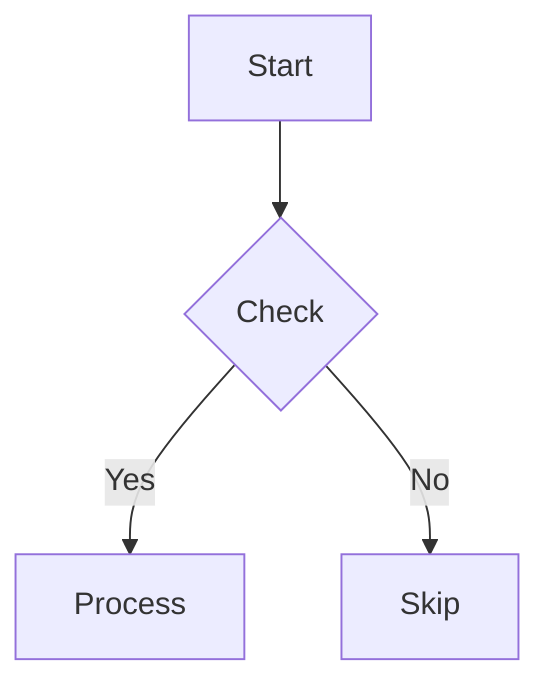

<div align="center">

# aiyu-md2pdf

**Markdown → PDF + Word · Mermaid Diagrams · Thai & English**

เครื่องมือแปลง Markdown เป็น PDF และ Word พร้อมไดอะแกรม Mermaid ความละเอียดสูง รองรับภาษาไทย — Cross-platform (Linux, macOS, Windows)

[Features](#features) · [Install](#install) · [Usage](#usage) · [Output](#output) · [Testing](#testing) · [CI](#ci) · [ภาษาไทย](#ภาษาไทย) · [Changelog](CHANGELOG.md) · [Contributing](CONTRIBUTING.md) · [Security](SECURITY.md)

[](https://github.com/aiyu/aiyu-md2pdf/actions/workflows/ci.yml)
[](https://github.com/aiyu/aiyu-md2pdf/actions/workflows/ci-windows.yml)
[](https://www.npmjs.com/package/aiyu-md2pdf)

</div>

---

## Features

- **Cross-platform** — Linux, macOS, Windows (Node.js CLI)
- **Thai + English** — Sarabun font with proper line breaking (no spaces needed between Thai words)
- **Mermaid diagrams** — auto-rendered to high-res PNG (3200×2400, scale 3×) + SVG
- **PDF + Word** — both formats generated in a single run
- **Auto Table of Contents** — numbered headings (1, 1.1, 1.1.1), depth 3
- **Figure captions** — auto-generated from the nearest heading or bold label
- **Centered diagrams** — images centered on page, constrained to 85% text height
- **Page breaks** — `##` sections always start on a new page; `###` flows naturally
- **High-contrast B&W** — diagrams suitable for photocopying
- **YAML frontmatter** — cover page and PDF metadata driven by each document
- **LaTeX-safe metadata** — YAML values are escaped before being injected into the preamble
- **npm package** — `npx aiyu-md2pdf` or `npm install -g aiyu-md2pdf`

---

## Install

### 1. Install the CLI

```bash
# Use without installing (recommended for one-off use)
npx aiyu-md2pdf docs/file.md

# Or install globally
npm install -g aiyu-md2pdf
aiyu-md2pdf docs/file.md
```

### 2. Install system dependencies

The CLI needs `pandoc`, `xelatex`, and `mmdc` (Mermaid CLI) on your PATH.

**Linux (apt):**
```bash
sudo apt-get install -y pandoc texlive-xetex texlive-lang-thai texlive-fonts-extra poppler-utils
npm install -g @mermaid-js/mermaid-cli@11.4.2
```

**macOS (brew):**
```bash
brew install pandoc texlive poppler
npm install -g @mermaid-js/mermaid-cli@11.4.2
```

**Windows (choco):**
```powershell
choco install pandoc miktex poppler -y
npm install -g @mermaid-js/mermaid-cli@11.4.2
```

**Sarabun font** (all platforms): Download from [Google Fonts](https://fonts.google.com/specimen/Sarabun) and install system-wide.

> **Note:** `@mermaid-js/mermaid-cli` is also listed as a `peerDependency` — `npm install` in this repo will install it automatically. For global CLI usage, install it separately.

---

## Usage

### CLI commands

```bash
# Build all .md files in docs/ (recursive)
aiyu-md2pdf

# Build a specific file
aiyu-md2pdf docs/my-document.md

# Build multiple files
aiyu-md2pdf a.md b.md

# Skip Mermaid rendering (reuse existing diagrams)
aiyu-md2pdf --no-mermaid docs/doc.md

# Keep .mmd source files for debugging
aiyu-md2pdf --keep-mermaid docs/doc.md

# Show help
aiyu-md2pdf --help
```

### Build pipeline

Each run executes six labeled stages:

| Stage | Action |
|-------|--------|
| `[1/6]` | Verify `pandoc`, `mmdc`, `xelatex` are installed |
| `[2/6]` | Render every ` ```mermaid ` block to PNG (3200×2400, scale 3×) + SVG |
| `[3/6]` | Build PDF via pandoc + XeLaTeX (TOC, numbered sections, cover page) |
| `[4/6]` | Build DOCX via pandoc + `reference.docx` template |
| `[5/6]` | Print build summary (PDF / DOCX counts, output paths) |
| `[6/6]` | Clean up intermediate `.mmd` files (unless `--keep-mermaid`) |

### YAML frontmatter

Each markdown file supports YAML frontmatter for the cover page and PDF metadata:

```yaml
---
title: "Document Title"           # Cover title (required; falls back to filename)
subtitle: "A subtitle"             # Cover subtitle
author: "Author Name"              # Cover author field
date: "27 August 2026"             # Cover date field
document: "Document Type"          # Cover document type field
---
```

Special LaTeX characters (`\ & % $ # _ { } ~ ^`) in these values are automatically escaped, so frontmatter cannot inject LaTeX commands.

### Mermaid support

````markdown

````

Supported types: `graph`, `flowchart`, `sequenceDiagram`, `classDiagram`, `stateDiagram`, `erDiagram`, `gantt`, `pie`, `journey`, and more.

---

## File Structure

```
aiyu-md2pdf/
├── package.json                 # npm package config
├── bin/
│   └── cli.js                   # CLI entry point (commander.js)
├── src/
│   ├── index.js                 # Main orchestrator (6-stage pipeline)
│   ├── yaml.js                  # Frontmatter parsing + LaTeX escaping
│   ├── mermaid.js               # Mermaid render loop
│   ├── pandoc.js                # pandoc invocation (PDF + DOCX)
│   ├── paths.js                 # Cross-platform path resolution
│   └── deps.js                  # Check pandoc/xelatex/mmdc exist
├── assets/                      # Static files
│   ├── preamble.tex             # LaTeX preamble (fonts, layout, styles)
│   ├── mermaid-theme.txt        # Mermaid theme (B&W high-contrast)
│   ├── puppeteer-config.json    # Puppeteer config for mmdc
│   └── reference.docx           # Word template (Sarabun font)
├── docs/                        # Input: place .md files here
│   ├── example/
│   │   ├── example-th.md
│   │   └── example-en.md
│   └── e2e-system-architecture.md
├── tests/
│   ├── fixtures/                # Test input files (5 files)
│   ├── unit/                    # Unit tests (no system deps needed)
│   ├── e2e/                     # End-to-end tests (need pandoc+xelatex)
│   └── helpers.js               # Shared test utilities
├── scripts/
│   └── install-ci-deps.sh       # CI dependency installer
├── legacy/                      # Previous bash version (for reference)
├── .github/workflows/           # GitHub Actions CI
├── LICENSE                      # MIT
├── CHANGELOG.md                 # Version history
├── CONTRIBUTING.md              # Contribution guidelines
├── CODE_OF_CONDUCT.md           # Community standards
├── SECURITY.md                  # Security policy & reporting
└── README.md
```

---

## Output

Each build produces PDF + DOCX in `result/output/` and diagrams in `result/diagrams/{filename}/`:

```
result/
├── output/
│   ├── example-th.pdf           # PDF with TOC, numbered sections, captions
│   ├── example-th.docx          # Word with Sarabun font
│   └── e2e-system-architecture.pdf
└── diagrams/
    └── example-th/
        ├── 001.png              # High-res PNG (3200×2400, scale 3×)
        ├── 001.svg              # Vector SVG
        └── ...
```

PDF and DOCX are flat in `result/output/` — easy to find. Diagrams are grouped by filename under `result/diagrams/`. Each build overwrites the previous output for the same file.

---

## Customization

| What | File | Example |
|------|------|---------|
| Document font | `assets/preamble.tex` | `\setmainfont{Sarabun}` |
| Diagram style | `assets/mermaid-theme.txt` | `"fontSize": "24px"` |
| Diagram colors | `assets/mermaid-theme.txt` | `"primaryColor": "#FFFFFF"` |
| Image max size | `assets/preamble.tex` | `height=0.85\textheight` |
| Page margins | `assets/preamble.tex` | `\geometry{margin=2.5cm}` |
| Header/Footer | `assets/preamble.tex` | `\fancyhead[L]{...}` |
| Cover page layout | `assets/preamble.tex` | `\renewcommand{\maketitle}{...}` |
| Word styles | `assets/reference.docx` | Edit in Word, save as reference.docx |

---

## Testing

```bash
# Run all tests (unit + e2e)
npm test

# Run only unit tests (no system deps needed)
npm run test:unit

# Run only e2e tests (requires pandoc + xelatex + mmdc)
npm run test:e2e

# Watch mode for development
npm run test:watch

# Lint
npm run lint

# Build example
npm run build:example
```

| Test type | Count | Needs system deps? | Speed |
|-----------|-------|-------------------|-------|
| Unit | 46 | No | <1s |
| E2E | 10 | Yes (pandoc, xelatex, mmdc) | ~60s |

---

## CI

GitHub Actions runs on every push and pull request:

| Workflow | OS | Jobs |
|----------|----|------|
| `ci.yml` | ubuntu-latest | lint (shellcheck), unit tests, e2e tests |
| `ci-windows.yml` | windows-latest | e2e tests (with MiKTeX) |

Build artifacts are uploaded on test failure for debugging.

---

## Troubleshooting

| Symptom | Fix |
|---------|-----|
| `pandoc: command not found` | Install pandoc (see [Install](#install)) |
| `mmdc: command not found` | `npm install -g @mermaid-js/mermaid-cli@11.4.2` |
| `xelatex: command not found` | Install TeX distribution (TinyTeX / TeX Live / MiKTeX) |
| Thai text not breaking | Confirm Sarabun is installed: `fc-list \| grep -i sarabun` (Linux) |
| Mermaid render timeout | Re-run with `--no-mermaid` to reuse existing PNGs |
| PDF missing diagrams with `--no-mermaid` | Run a full build once first |
| `pandoc failed` | Check `build/pandoc.log` for details |

---

## ภาษาไทย

### คุณสมบัติ

- **รองรับทุกแพลตฟอร์ม** — Linux, macOS, Windows (Node.js CLI)
- **รองรับภาษาไทยและอังกฤษ** — ฟอนต์ Sarabun พร้อมการตัดบรรทัดภาษาไทยที่ถูกต้อง
- **Mermaid diagrams** — แปลงเป็นรูปความละเอียดสูงอัตโนมัติ (3200×2400, scale 3×) + SVG
- **PDF + Word** — สร้างทั้งสองฟอร์แมตพร้อมกันในครั้งเดียว
- **สารบัญอัตโนมัติ** — เลขหัวข้อ (1, 1.1, 1.1.1) ความลึก 3 ระดับ
- **Caption ใต้รูป** — สร้างอัตโนมัติจากหัวข้อหรือ bold label ใกล้ที่สุด
- **npm package** — `npx aiyu-md2pdf` หรือ `npm install -g aiyu-md2pdf`

### การติดตั้ง

ดูส่วน [Install](#install) ด้านบน — มีคำสั่งสำหรับ Linux, macOS, และ Windows

### การใช้งาน

```bash
# Build ทุกไฟล์ใน docs/
aiyu-md2pdf

# Build ไฟล์เฉพาะ
aiyu-md2pdf docs/my-document.md

# ข้าม Mermaid rendering (ใช้รูปเดิม)
aiyu-md2pdf --no-mermaid docs/doc.md

# เก็บไฟล์ .mmd สำหรับ debug
aiyu-md2pdf --keep-mermaid docs/doc.md
```

### โครงสร้างผลลัพธ์

```
result/
├── output/                      ← PDF + DOCX (หาง่าย)
│   ├── example-th.pdf
│   └── example-th.docx
└── diagrams/                    ← รูปไดอะแกรม
    └── example-th/
        ├── 001.png
        └── 001.svg
```

### การทดสอบ

```bash
npm test              # รันทุก test
npm run test:unit     # unit tests เท่านั้น (ไม่ต้องมี pandoc/xelatex)
npm run test:e2e      # e2e tests (ต้องมี pandoc + xelatex + mmdc)
```

---

## Community

- [Contributing](CONTRIBUTING.md) — how to set up, develop, and submit PRs
- [Code of Conduct](CODE_OF_CONDUCT.md) — community standards
- [Security Policy](SECURITY.md) — reporting vulnerabilities
- [Changelog](CHANGELOG.md) — version history

---

## License

MIT — see [LICENSE](LICENSE).
