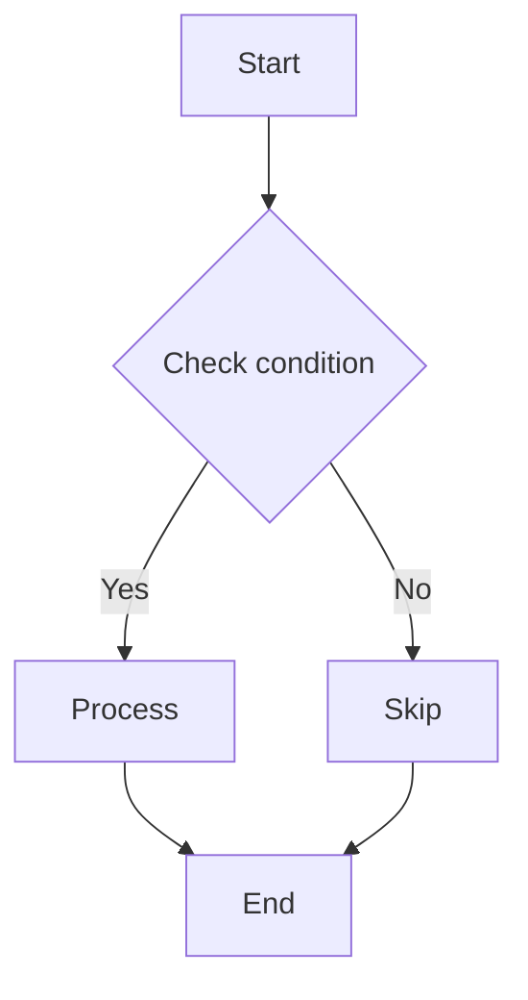
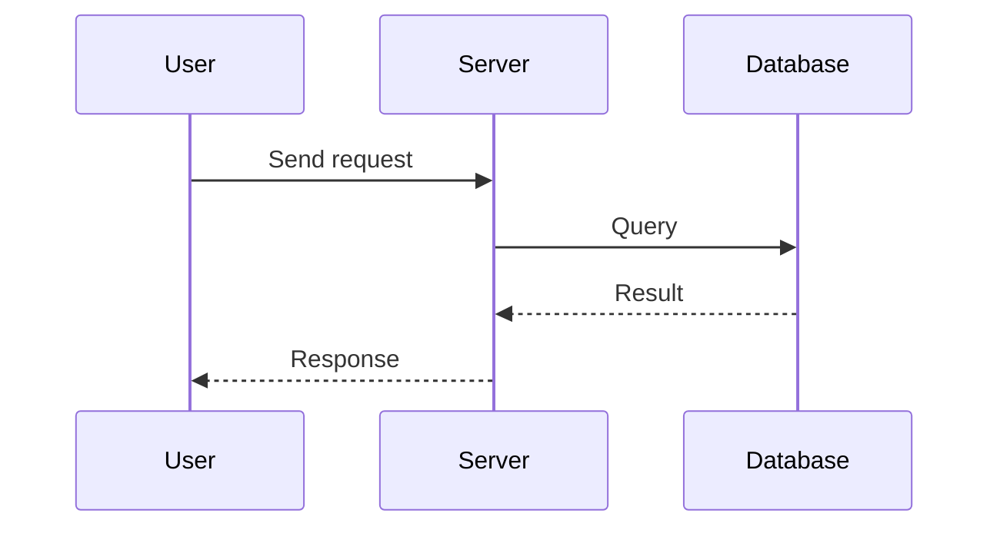
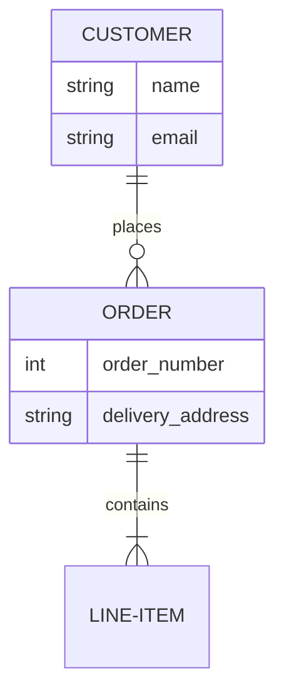

\newpage

# Document Overview

This document demonstrates **aiyu-md2pdf** — a tool to convert Markdown into PDF and Word with Mermaid diagrams.

## Features

- **Thai & English support** — Sarabun font (Google Fonts)
- **Mermaid diagrams** — auto-rendered to high-resolution images
- **PDF + Word** — generates both formats simultaneously
- **Table of Contents** — automatic, with numbered headings
- **Figure captions** — "Figure X.Y: diagram name" auto-generated
- **Centered diagrams** — images centered on the page
- **Page breaks** — `## x.x` sections start on a new page

## Usage

1. Place `.md` files in the `docs/` folder
2. Run `./build.sh`
3. PDF and DOCX files are generated in the root folder

\newpage

# Diagram Examples

## Flowchart

Example of a flowchart:

## Sequence Diagram

Example of a sequence diagram:

## ER Diagram

Example of an entity-relationship diagram:

\newpage

# Configuration

## Mermaid Theme

Edit `mermaid-theme.txt` to change colors, font size, and diagram style.

## LaTeX Preamble

Edit `preamble.tex` to change:
- Document font
- Heading styles
- Header / Footer
- Image size
- Page layout

## Word Template

Edit `reference.docx` to change Word output styles.
