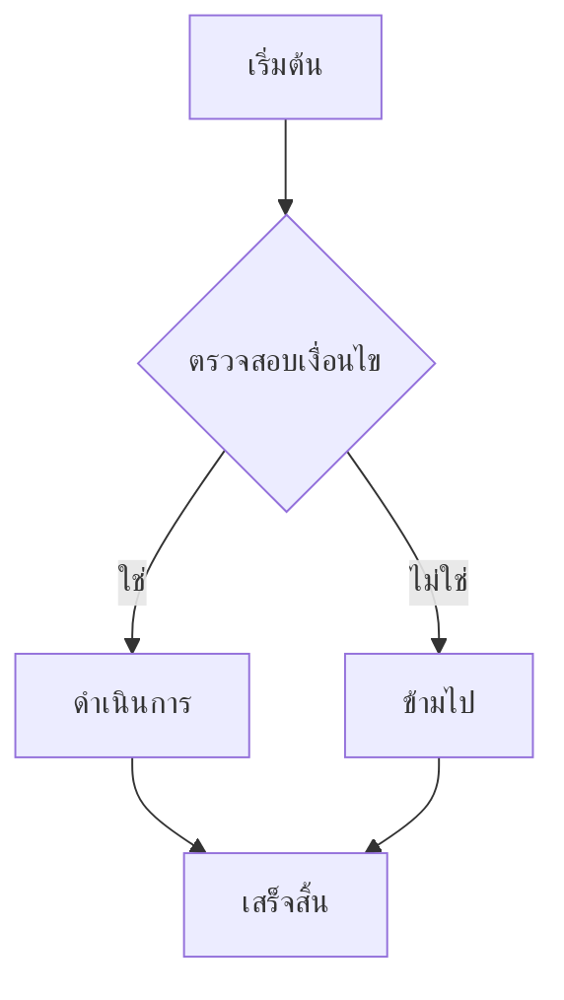
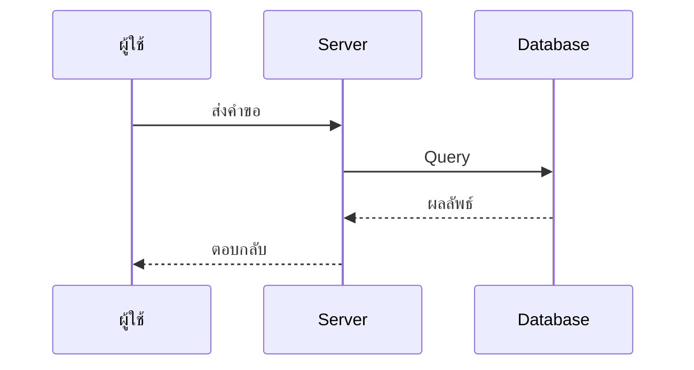
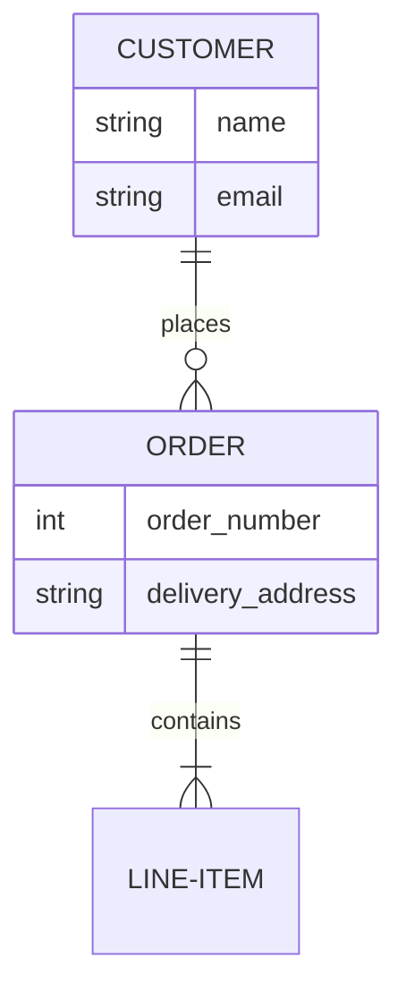

\newpage

# ภาพรวมเอกสาร

เอกสารนี้เป็นตัวอย่างการใช้ **aiyu-md2pdf** สำหรับแปลง Markdown เป็น PDF และ Word พร้อมไดอะแกรม Mermaid ที่รองรับภาษาไทย

## คุณสมบัติ

- รองรับ **ภาษาไทย** (ฟอนต์ Sarabun)
- แปลง **Mermaid diagrams** เป็นรูปความละเอียดสูงอัตโนมัติ
- สร้าง **PDF** และ **Word (.docx)** พร้อมกัน
- **Table of Contents** อัตโนมัติ พร้อมเลขหัวข้อ
- ไดอะแกรมจัดกึ่งกลางหน้า พร้อม caption
- หัวข้อ `## x.x` ขึ้นหน้าใหม่เสมอ

## การใช้งาน

1. วางไฟล์ `.md` ในโฟลเดอร์ `docs/`
2. รัน `./build.sh`
3. ไฟล์ PDF และ DOCX จะถูกสร้างในโฟลเดอร์หลัก

\newpage

# ตัวอย่างไดอะแกรม

## Flowchart

ตัวอย่าง Flowchart แบบต่าง ๆ:

## Sequence Diagram

ตัวอย่าง Sequence Diagram:

## ER Diagram

ตัวอย่าง Entity Relationship:

\newpage

# การตั้งค่า

## การแก้ไข Theme

แก้ไข `mermaid-theme.txt` เพื่อเปลี่ยนสี ขนาดฟอนต์ และสไตล์ของไดอะแกรม

## การแก้ไข LaTeX Preamble

แก้ไข `preamble.tex` เพื่อเปลี่ยน:
- ฟอนต์เอกสาร
- สไตล์หัวข้อ
- Header / Footer
- ขนาดรูป
- การจัดหน้า

## การแก้ไข Word Template

แก้ไข `reference.docx` เพื่อเปลี่ยนสไตล์ของ Word output
