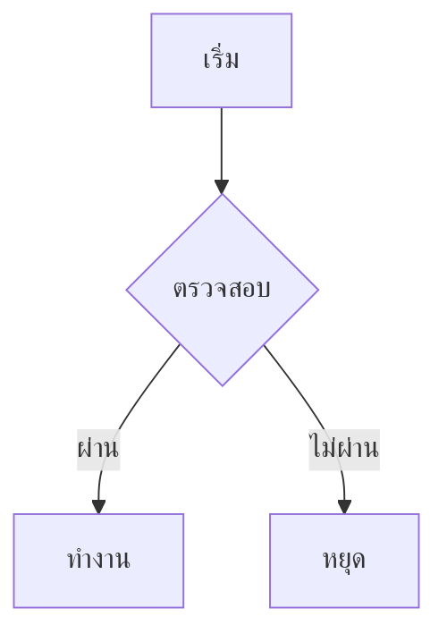
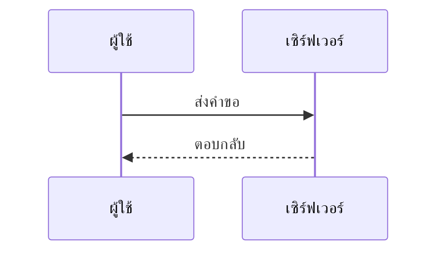
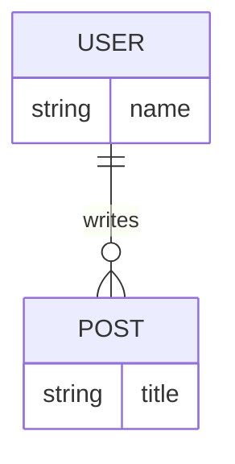

\newpage

# ภาพรวม

เอกสารทดสอบ Mermaid ภาษาไทย

## Flowchart

```mermaid
graph TD
    A[เริ่ม] --> B{ตรวจสอบ}
    B -->|ผ่าน| C[ทำงาน]
    B -->|ไม่ผ่าน| D[หยุด]
```

## Sequence

```mermaid
sequenceDiagram
    participant U as ผู้ใช้
    participant S as เซิร์ฟเวอร์
    U->>S: ส่งคำขอ
    S-->>U: ตอบกลับ
```

## ER Diagram

```mermaid
erDiagram
    USER ||--o{ POST : writes
    USER {
        string name
    }
    POST {
        string title
    }
```
